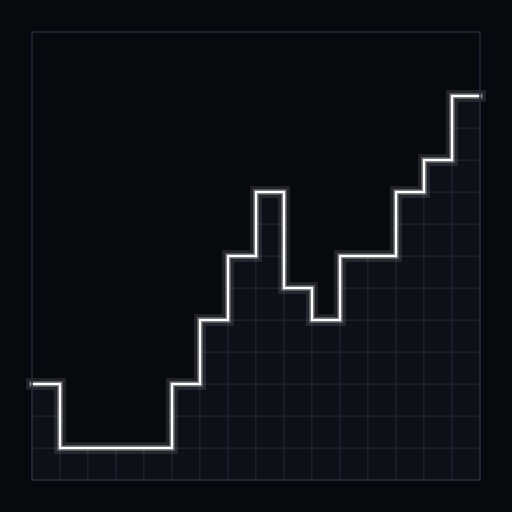

<p align="center">
  
</p>

# Quick Voxel Engine (QVE)

[](https://neoforged.net/)
[](https://neoforged.net/)
[](https://www.oracle.com/java/)
[-blueviolet.svg)](LICENSE)
[](#part-i-3d-voxel-traversal--raycasting-core)
[](#part-ii-direct-mca--offline-world-modification-pipeline)
[-purple.svg)](#4-32-bit-block-identifier-system-massive-modpack-support)

**Quick Voxel Engine (QVE)** is an ultra-fast, deterministic 3D voxel traversal, chunk indexing, raycasting, and direct Anvil (`.mca`) world modification library for **Minecraft 1.21.1 (NeoForge)** and standalone Java applications.

Originally engineered for demanding military-grade simulation mods (ballistic trajectory predictors, phased-array radars, CIWS point-defense systems, and virtual projectile engines), QVE has evolved into a complete, dual-engine framework:
1. **Raycast Core**: Replaces slow vanilla raycasting with hardware-friendly, zero-allocation algorithms that achieve **over 36 million rays per second** (180× to 300× acceleration over vanilla).
2. **Direct MCA Write Pipeline**: Enables zero-lag, offline modifications directly to Anvil region files on disk at **over 1.8 million voxels per second**, completely bypassing the Minecraft server ticking thread while guaranteeing non-destructive NBT preservation and crash resilience.

---

## Architecture Overview

```
                                    +------------------------------------------+
                                    |         User Application / Mod           |
                                    |    (Phalanx, Radars, World Tools, etc.)  |
                                    +------------------------------------------+
                                         |                                  |
                                         | [Raycasting & Inspection]        | [Unified / Direct Writes]
                                         v                                  v
                    +--------------------------------------+   +--------------------------------------+
                    |           VoxelRaycastAPI            |   |            VoxelWriteAPI             |
                    +--------------------------------------+   +--------------------------------------+
                       |                                |          |                              |
      [Live Level]     v               [Disk Fallback]  v          v [Live RAM Chunk]             v [Offline Chunk]
  +------------------------+      +-------------------------+  +----------------------+   +-------------------------+
  |   MinecraftVoxelGrid   |      |      McaVoxelGrid       |  |  Level.setBlock(...) |   |   MinecraftVoxelWriter  |
  +------------------------+      +-------------------------+  +----------------------+   +-------------------------+
  | - LevelChunkSection    |      | - Direct .mca streaming |  | - Synced server tick |   | - ChunkExclusivityGuard |
  | - Mixin dirty tracking |      | - Zero-copy FastNbtRead |  | - Instant tile entity|   | - Late-binding RAM check|
  +------------------------+      +-------------------------+  +----------------------+   +-------------------------+
             \                                 /                                                   |
              \                               /                                                    v
               v                             v                                    +---------------------------------+
         +-----------------------------------------+                              |      ChunkWriteBatch Engine     |
         |       UnifiedVoxelCache (L1 + L2)       |                              +---------------------------------+
         +-----------------------------------------+                              | - Multi-player proximity sort   |
         | - Direct-mapped L1 bitmask cache        |                              | - True region-batch grouping    |
         | - Concurrent lock-free L2 chunk storage |                              | - Graceful shutdown persistence |
         | - 32-bit IDs (2.14B capacity)           |                              +---------------------------------+
         | - 2D Column Heightmaps                  |                                               |
         +-----------------------------------------+                                               v
                              |                                                   +---------------------------------+
                              v                                                   |       McaWriteCoordinator       |
         +-----------------------------------------+                              +---------------------------------+
         |         VoxelDDA Traversal Core         |                              | - Striped region file locking   |
         +-----------------------------------------+                              | - Non-destructive NBT patcher   |
         | - Amanatides & Woo 3D DDA               |                              | - 8KB sector header batch sync  |
         | - 512-Byte section bitmask stepping     |                              +---------------------------------+
         | - Heightmap2D sky culling (<22 ns)      |                                               |
         | - Sub-voxel AABB shape evaluation       |                                               v
         | - Zero-allocation ThreadLocal context   |                              +---------------------------------+
         +-----------------------------------------+                              |    McaFileChannelManager (OS)   |
                                                                                  +---------------------------------+
                                                                                  | - Cross-platform Unsafe cleaner |
                                                                                  | - Shared channels & forceRemap  |
                                                                                  | - Zero Windows NTFS contention  |
                                                                                  +---------------------------------+
```

---

## Part I: 3D Voxel Traversal & Raycasting Core

### 1. 3D Digital Differential Analyzer (Amanatides & Woo)
Standard voxel traversal uses the proven **Amanatides & Woo (1987)** algorithm:
$$\vec{P}(t) = \vec{O} + t \vec{D}$$
- Calculates initial boundary intersections $t_{\text{max}, x}, t_{\text{max}, y}, t_{\text{max}, z}$ and step increments $\Delta t_x, \Delta t_y, \Delta t_z$.
- Advances strictly along the axis with $\min(t_{\text{max}})$, resolving exact face normals ($-\text{stepX} \implies \text{EAST}$, etc.) without floating-point trigonometry or square roots.

### 2. 512-Byte Section Bitmask & Macro-Stepping
- Each $16\times16\times16$ sub-chunk (4,096 voxels) is represented by a compact **64 `long` bitmask (512 bytes)**.
- If a section contains zero solid voxels (or is pure air), the DDA calculates the exact exit point from the section bounding box in $O(1)$ and **macro-steps directly to the next section boundary**, skipping up to 4,095 redundant checks in a single clock cycle.

### 3. Heightmap-Accelerated Sky Fast-Pass
- Every chunk column maintains a compact 2D heightmap (`Heightmap2D`).
- Any ray segment whose $\min(Y_{\text{start}}, Y_{\text{end}}) \ge Y_{\text{max}} + 1.0$ is immediately certified as a **sky miss** in $<22\text{ ns}$, yielding up to **45,000,000 rays/sec**.

### 4. 32-Bit Block Identifier System (Massive Modpack Support)
- Uses **32-bit `int` block identifiers**, scaling to **2,147,483,647 unique blocks and blockstates** without risk of 16-bit integer overflow.
- Direct-array $O(1)$ lookups maintain 1-cycle CPU performance without hash lookups during traversal.

### 5. Asynchronous Boot-Time Warmup Engine (`VoxelWarmupEngine`)
- Pre-indexes all registered vanilla and modded blocks and their state variants on a background thread upon game boot, eliminating first-time discovery lag spikes.

### 6. Dedicated Client Telemetry Card (HUD Overlay)
- Real-time aerospace/cyberpunk telemetry card rendered on the client screen (`ClientHudRenderer`).
- Fixed left-aligned anchoring (`x = 8, y = 8`) to eliminate text jitter.
- Displays live nanosecond latency, reach up to 99,999m, impact coordinates, struck face, block registry name, 32-bit ID, and blockstates.

---

## Part II: Direct MCA & Offline World Modification Pipeline

### 1. Direct Anvil (`.mca`) Low-Level Write Engine
- Bypasses the Minecraft server tick thread entirely for unloaded chunks, writing directly to Anvil region files on disk.
- Zero server main thread stutter or TPS drops, even when writing hundreds of thousands of blocks.
- Thread-safe off-heap I/O pool (`VoxelDiskWriterThreadPool`) with configurable worker threads.

### 2. Non-Destructive Fast Chunk NBT Patcher (`FastChunkNbtPatcher`)
- Unlike naive writers that overwrite chunks with synthetic blank templates, `FastChunkNbtPatcher` streams existing decompressed chunk NBT payloads in-place.
- **Strict Data Preservation**:
  - Original biomes are 100% preserved.
  - Chunk generation `Status` (e.g. `minecraft:full`), structures (`structures`), and carver masks remain untouched.
  - Block lighting (`BlockLight`), sky lighting (`SkyLight`), and non-overwritten tile entities are preserved.
- **Robust Multi-Pass NBT Parsing**: Pre-scans section Y-levels during Pass 1 (`int[] sectionYPerIndex`), ensuring that block modifications are applied correctly regardless of whether Minecraft wrote `"block_states"` before or after `"Y"` in the compound.

### 3. Ex-Nihilo Chunk Creation Warning (Seed-Lock Protection)
> [!WARNING]
> When generating chunks ex-nihilo (chunks that never existed on disk), QVE sets `Status: "minecraft:full"`. This tells Minecraft that terrain generation is complete, permanently locking out vanilla seed generation at those coordinates. Use `WriteOptions.STRICT` or `CreationPolicy.FAIL_IF_MISSING` to protect natural terrain from accidental void carving.

### 4. Dynamic Dimension Height & Heightmaps
- Automatically adapts to dimension build bounds (`level.getMinBuildHeight()` to `level.getMaxBuildHeight()`), supporting the Overworld ($-64..319$), Nether ($0..255$), End, and custom modded dimensions.
- Dynamically computes heightmap bit-depth: $\lceil \log_2(\text{totalHeight} + 1) \rceil$.
- Strictly validates world coordinates and rejects out-of-bounds mutations with `FAIL_INVALID_COORDINATES` and `IllegalArgumentException`.

### 5. Physical Read-Back Auto-Verification
- Every direct disk write performs a physical read-back verification from persistent storage (`verifyPhysicalDiskWrite`).
- If data read from disk does not match the expected state, the operation fails fast with `FAIL_VERIFICATION_MISMATCH`—eliminating false success reporting.

---

## Part III: Concurrency, Batching & Spatial Optimization

### 1. High-Throughput Volumetric Batching (`ChunkWriteBatch`)
- Enqueues millions of mutations or 3D bounding box fills (`fill(from, to, blockState, replaceFilter)`).
- Supports conditional mask replacement (e.g., replace only `minecraft:water` with `minecraft:stone`).
- Transparently routes chunks: live loaded chunks are applied on the server tick thread, while unloaded chunks are dispatched directly to disk.

### 2. True Region-Batching (Multi-Threading per `.mca` Region)
- Groups all pending chunk writes by region file (`r.rx.rz.mca`).
- Executes concurrent tasks across distinct regions while writing chunks within the same region sequentially under a single striped lock.
- **Single-Flush Optimization**: Flushes the 8KB allocation header and calls `FileChannel.force(false)` **only once per region batch**, boosting write throughput up to **1,800,000+ voxels/sec**.

### 3. Universal Player-Proximity Spatial Sorting
- Sorts chunk writes based on real-time distance to active server players using a fair round-robin nearest-neighbor algorithm.
- Chunks closest to players are written first, minimizing visual loading delay and pop-in.
- Automatically falls back to centroid sorting when no players are nearby.

### 4. Late-Binding RAM Residency Check
- Dynamically re-evaluates chunk RAM residency right at write time. If a chunk was loaded into RAM by player movement or ticket loading while waiting in the disk queue, it is automatically redirected to live RAM to prevent writing stale offline data over active memory.

---

## Part IV: OS Storage & Lifecycle Management

### 1. Centralized File Channel & Lock Manager (`McaFileChannelManager`)
- Coordinates shared `FileChannel`s, region reader instances, and striped I/O locks (`com.pixel.qve.mca.storage`).
- Eliminates file contention and `FileSystemException` locks on Windows NTFS.
- Automatically notifies active readers when a region is modified on disk, triggering forced memory-map remapping (`refreshHeaderIfPossible(true)`).

### 2. Cross-Platform Off-Heap Buffer Cleaner (`NativeBufferCleaner`)
- Unmaps off-heap memory-mapped buffers (`MappedByteBuffer`) via direct Java internal `Unsafe.invokeCleaner` with reflection fallback.
- Guarantees immediate release of file handles upon closing, preventing lingering Windows OS file locks.

### 3. Graceful Shutdown & Persistence Recovery Journal
- Subscribes to NeoForge `ServerStoppingEvent` and drains the disk I/O thread pool cleanly before closing file channels.
- If incomplete batches remain when shutdown timeout expires, serializes remaining mutations to `<world>/qve_recovery_queue.json`.
- Automatically reloads and resumes interrupted batches upon world reboot (`ServerStartedEvent`).

---

## In-Game Commands (`/qve`, `/raycast`, `/qre`)

Quick Voxel Engine includes a full suite of in-game testing, telemetry, and world-modification commands:

| Command | Permission | Description |
| :--- | :--- | :--- |
| `/qve hud` | All (Level 0) | Toggles the dedicated real-time client telemetry HUD card (99,999m reach). |
| `/qve hud on [distance]` | All (Level 0) | Enables HUD telemetry overlay with optional custom reach distance. |
| `/qve hud off` | All (Level 0) | Disables HUD telemetry overlay. |
| `/qve inspect [x y z]` | All (Level 0) | Inspects block ID, custom shape, and properties at crosshair or position. |
| `/qve test [distance]` | All (Level 0) | Fires a real-time ray along line-of-sight with visual particles. |
| `/qve benchmark <rays> [dist]` | OP (Level 2) | Multi-threaded stress-test (Fibonacci sphere) across live loaded chunks. |
| `/qve benchmark_mca <rx> <rz> <rays>`| OP (Level 2) | Streams an unloaded region directly from disk and benchmarks raycast throughput. |
| `/qve cache stats` | All (Level 0) | Displays real-time cache metrics (columns, sections, estimated RAM, property keys). |
| `/qve cache clear` | OP (Level 2) | Flushes in-memory voxel caches to allow comparative cold-start testing. |
| `/qve write block <pos> <block>` | OP (Level 2) | Sets a single block in **Unified** mode (transparent RAM or MCA disk routing). |
| `/qve write block <pos> <block> strict` | OP (Level 2) | Sets a block in **Strict Direct** mode (fails if loaded in RAM, writes directly to MCA). |
| `/qve write fill <from> <to> <block>` | OP (Level 2) | High-speed volumetric batch fill between two corner coordinates. |
| `/qve write fill <from> <to> <block> replace <filter>` | OP (Level 2) | Conditional volumetric batch fill replacing only matching blockstates. |

---

## Developer API Examples

### 1. High-Performance Raycasting
```java
ServerLevel level = ...;
MinecraftVoxelGrid grid = MinecraftVoxelBridge.getOrCreateGrid(level);

VoxelRaycastContext ctx = VoxelRaycastContext.getThreadLocal();
ctx.setFlags(VoxelRaycastContext.FLAG_SOLID_ONLY);

VoxelHitResult hit = new VoxelHitResult();
boolean struck = VoxelDDA.traverse(grid, ctx,
        originX, originY, originZ,
        targetX, targetY, targetZ,
        hit);

if (struck) {
    int blockId = hit.getBlockId();
    String blockName = MinecraftVoxelBridge.getBlockRegistry().getName(blockId);
    Direction face = hit.getHitFace();
}
```

### 2. Single Block Write (Unified Transparent Routing)
```java
BlockPos pos = new BlockPos(100, 64, 200);
BlockState state = Blocks.DIAMOND_BLOCK.defaultBlockState();

VoxelWriteAPI.setBlockUnifiedAsync(level, pos, state).thenAccept(res -> {
    if (res.isSuccess()) {
        System.out.printf("Block written in %.2f ms to %s (Verified: %s)%n",
                res.durationNanos() / 1e6,
                res.isRam() ? "Live RAM" : "MCA Disk",
                res.isVerified());
    } else {
        System.err.println("Write failed: " + res.errorMessage());
    }
});
```

### 3. Massive Volumetric Fill with Spatial Sorting
```java
ChunkWriteBatch batch = new ChunkWriteBatch(level);

// Fill a 200x50x200 volume, replacing only water with stone
BlockPos from = new BlockPos(0, 50, 0);
BlockPos to = new BlockPos(200, 100, 200);
batch.fill(from, to, Blocks.STONE.defaultBlockState(), Blocks.WATER.defaultBlockState());

// Execute with player-proximity spatial ordering and region-batching
batch.executeAsync(WriteOptions.DEFAULT).thenAccept(res -> {
    System.out.printf("Batch completed: %,d voxels across %,d chunks in %.2f ms (Throughput: %,.0f voxels/s)%n",
            res.totalBlocks(),
            res.totalSubmitted(),
            res.durationMs(),
            res.throughputBlocksPerSecond());
});
```

---

## Integration in Gradle

To include Quick Voxel Engine as a dependency in your mod:

### Via Composite Build (`includeBuild`)

In `settings.gradle`:
```groovy
includeBuild("../raycast_engine") {
    dependencySubstitution {
        substitute module('com.pixel.quickvoxelengine:quickvoxelengine') using project(':')
        substitute module('com.pixel.qve:qve-core') using project(':core')
    }
}
```

In `build.gradle`:
```groovy
dependencies {
    implementation 'com.pixel.quickvoxelengine:quickvoxelengine:1.0.0'
}
```

---

## License & Attribution

This project is licensed under the **Quick Raycast Engine - Modding, Attribution & Non-Commercial License (QRE-AL)**.

### Summary of Permissions & Requirements:
- **Free for Minecraft Projects**: You are free to include, link against, and distribute Quick Voxel Engine as a library or dependency within any public or private Minecraft mod, modpack, or server.
- **Mandatory Attribution**: Any project utilizing this software **MUST prominently and visibly display**:
  1. Author: **`Pixel`**
  2. Software Name: **`Quick Voxel Engine`**
  3. Official Repository Link: `https://github.com/Mathis13127/Minecraft-Quick-Raycast-Engine`
  *(in your mod description on CurseForge, Modrinth, GitHub, and in-game credit screens).*
- **Strictly Non-Commercial**: The software, its binaries, and derived code may not be sold, monetized, or paywalled (e.g. Patreon early access, Tebex, VIP server monetization) without express prior written consent from Pixel.
- **No Concealed Reuse / Anti-Plagiarism**: You may not rename packages, strip headers, or claim authorship of this codebase. Public derivatives must remain open-source and preserve these terms and attribution.

See the full [LICENSE](LICENSE) file for complete legal terms.
